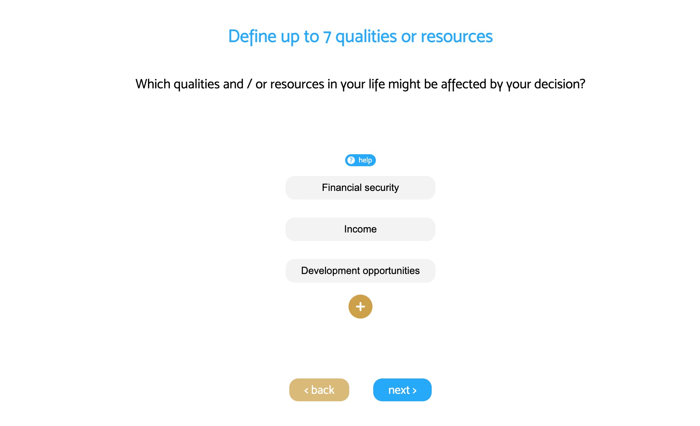

## Easy Decision project

A structured technique for organizing and analyzing complex decisions, based on mathematics and psychology. Easy Decision is based on the Analytic Hierarchy Process (AHP) which is widely used in economy, but made so easy, you can use it for your daily life or business.

This is a full stack application, created with react, next.js and postgreSQL.

### Current status

The app is in pre-alpha development. An alpha release is planned for the end of 2022.

### Screenshots

### Dev notes

Reading on AHP: http://relaunch.rene-riedl.at/wp-content/uploads/2018/02/hmd_246.pdf
Chart library: https://www.npmjs.com/package/eazychart-react
Matrix calculation: https://www.robinwieruch.de/linear-algebra-matrix-javascript/
